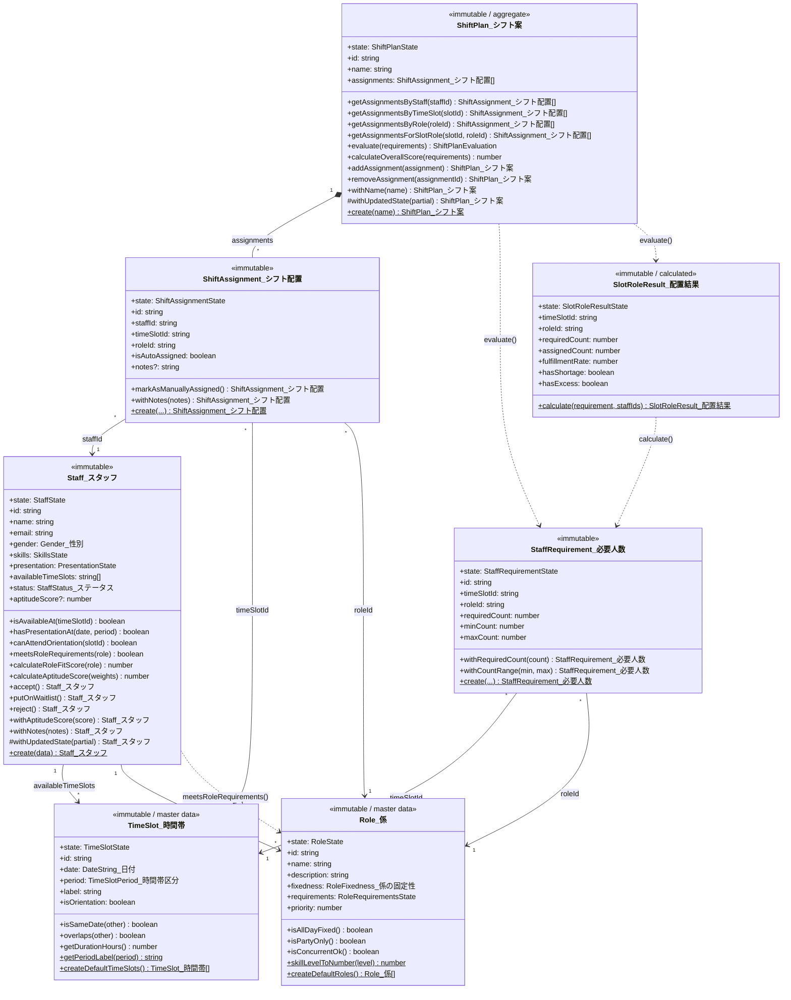
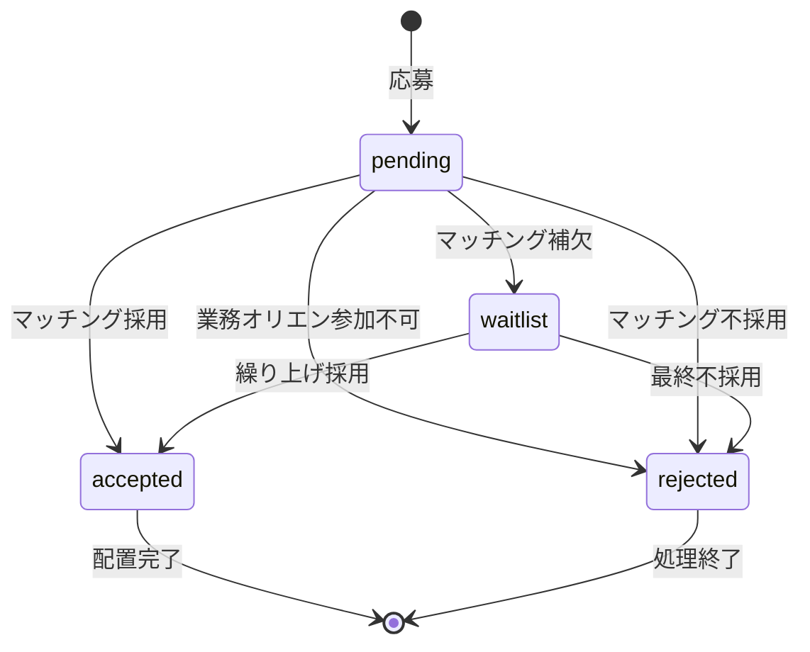
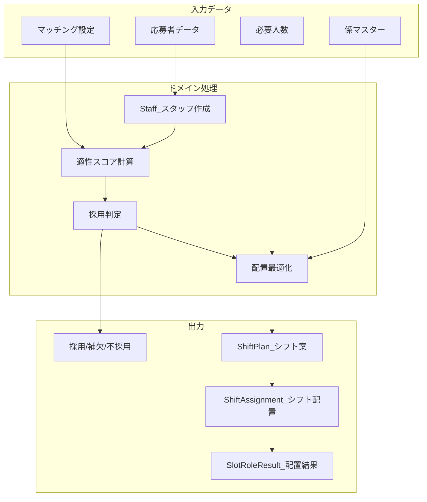

# 学会シフト生成システム - ドメインモデル

## クラス図

## 型一覧

| 型名 | 説明 |
|------|------|
| `DateString_日付` | 日付文字列 (YYYY-MM-DD形式) |
| `TimeSlotPeriod_時間帯区分` | 時間帯区分 (all_day/morning/afternoon/evening/party) |
| `SkillLevel_スキルレベル` | スキルレベル (none/beginner/intermediate/advanced) |
| `RoleFixedness_係の固定性` | 係の固定性 (all_day_fixed/time_slot_ok/concurrent_ok/party_only) |
| `StaffStatus_ステータス` | スタッフステータス (pending/accepted/waitlist/rejected) |
| `Gender_性別` | 性別 (male/female/other/prefer_not_to_say) |

## 状態遷移図（StaffStatus_ステータス）

## データフロー

## 時間帯構成（15枠）

| 日付 | 時間帯 | 備考 |
|------|--------|------|
| 3/24（月） | 終日 | 準備日（設営） |
| 3/25（火） | 午前 | 準備日 |
| 3/25（火） | 午後 | **業務オリエン（必須）** |
| 3/26（水） | 午前/午後/夕刻 | 会期1日目 |
| 3/27（木） | 午前/午後/夕刻/懇親会 | 会期2日目 |
| 3/28（金） | 午前/午後/夕刻 | 会期3日目 |
| 3/29（土） | 午前/午後 | 会期4日目（撤去） |

## 係一覧（13種類）

| ID | 係名 | 固定性 | 優先度 |
|----|------|--------|--------|
| headquarters | 年会本部 | 全日固定 | 100 |
| venue_check | 会場チェック係 | 時間帯OK | 90 |
| venue | 会場係 | 時間帯OK | 85 |
| reception | 総合案内 | 時間帯OK | 80 |
| mobile_support | 機動運用係 | 時間帯OK | 75 |
| badge_reissue | 参加証再発行 | 時間帯OK | 70 |
| setup | 設営係 | 兼務可能 | 65 |
| cloakroom | クローク | 時間帯OK | 60 |
| exhibition | 展示係 | 時間帯OK | 55 |
| preview_room | 試写室係 | 時間帯OK | 50 |
| poster | ポスター係 | 時間帯OK | 50 |
| party_cloakroom | 懇親会クローク | 懇親会専用 | 40 |
| party_reception | 懇親会受付 | 懇親会専用 | 40 |
