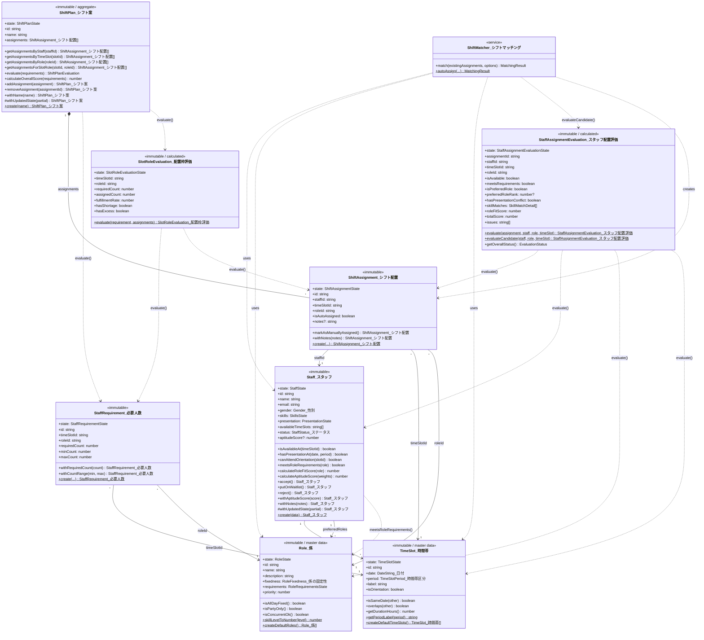
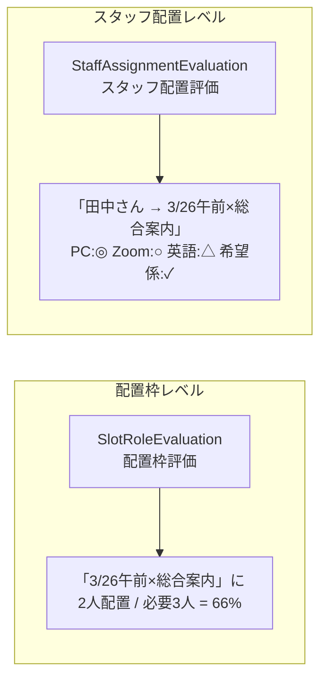

# 学会シフト生成システム - ドメインモデル

## クラス図



## 型一覧

| 型名 | 説明 |
|------|------|
| `DateString_日付` | 日付文字列 (YYYY-MM-DD形式) |
| `TimeSlotPeriod_時間帯区分` | 時間帯区分 (all_day/morning/afternoon/evening/party) |
| `SkillLevel_スキルレベル` | スキルレベル (none/beginner/intermediate/advanced) |
| `RoleFixedness_係の固定性` | 係の固定性 (all_day_fixed/time_slot_ok/concurrent_ok/party_only) |
| `StaffStatus_ステータス` | スタッフステータス (pending/accepted/waitlist/rejected) |
| `Gender_性別` | 性別 (male/female/other/prefer_not_to_say) |
| `EvaluationStatus` | 配置評価ステータス (excellent/good/acceptable/warning/error) |
| `SkillMatchDetail` | スキルマッチング詳細 (skillName, required, staffHas, isMatch, scoreDiff) |

## 評価クラスの比較

| クラス | 評価対象 | 粒度 | 目的 |
|--------|----------|------|------|
| `SlotRoleEvaluation_配置枠評価` | 時間帯×係（配置枠） | 集計レベル | 人員充足率の確認 |
| `StaffAssignmentEvaluation_スタッフ配置評価` | 個別のスタッフ配置 | 個別レベル | スタッフ適性の詳細確認 |



## 状態遷移図（StaffStatus_ステータス）


## データフロー


## 時間帯構成（15枠）

| 日付 | 時間帯 | 備考 |
|------|--------|------|
| 3/24（月） | 終日 | 準備日（設営） |
| 3/25（火） | 午前 | 準備日 |
| 3/25（火） | 午後 | **業務オリエン（必須）** |
| 3/26（水） | 午前/午後/夕刻 | 会期1日目 |
| 3/27（木） | 午前/午後/夕刻/懇親会 | 会期2日目 |
| 3/28（金） | 午前/午後/夕刻 | 会期3日目 |
| 3/29（土） | 午前/午後 | 会期4日目（撤去） |

## 係一覧（13種類）

| ID | 係名 | 固定性 | 優先度 |
|----|------|--------|--------|
| headquarters | 年会本部 | 全日固定 | 100 |
| venue_check | 会場チェック係 | 時間帯OK | 90 |
| venue | 会場係 | 時間帯OK | 85 |
| reception | 総合案内 | 時間帯OK | 80 |
| mobile_support | 機動運用係 | 時間帯OK | 75 |
| badge_reissue | 参加証再発行 | 時間帯OK | 70 |
| setup | 設営係 | 兼務可能 | 65 |
| cloakroom | クローク | 時間帯OK | 60 |
| exhibition | 展示係 | 時間帯OK | 55 |
| preview_room | 試写室係 | 時間帯OK | 50 |
| poster | ポスター係 | 時間帯OK | 50 |
| party_cloakroom | 懇親会クローク | 懇親会専用 | 40 |
| party_reception | 懇親会受付 | 懇親会専用 | 40 |

## バブルURL構造

学会シフト機能のバブルナビゲーションURL一覧：

| URL パターン | 表示内容 | 説明 |
|-------------|----------|------|
| `gakkai-shift/staffs` | スタッフ一覧 | 全スタッフのリスト |
| `gakkai-shift/staffs/{staffId}` | スタッフ詳細 | 個人情報・スキル・参加可能時間帯 |
| `gakkai-shift/staffs/{staffId}/availableTimeSlots` | 参加可能時間帯 | 時間帯選択UI |
| `gakkai-shift/shift-plans` | シフト案マネージャー | 複数シフト案のタブ管理 |
| `gakkai-shift/shift-plan/{shiftPlanId}` | シフト案エディタ | 単一シフト案の編集 |
| `gakkai-shift/shift-plans/{shiftPlanId}/assignments/{assignmentId}` | **スタッフ配置評価** | スタッフ×時間帯×係のマッチング結果 |

### スタッフ配置評価バブルの表示内容

```
┌─────────────────────────────────────────┐
│ 配置評価: 田中 太郎                      │
│ 3/26(水) 午前 → 総合案内                 │
├─────────────────────────────────────────┤
│ 総合評価: ★★★★☆ (良好)                 │
├─────────────────────────────────────────┤
│ ■ 時間帯                                │
│   参加可能: ✓                           │
│   発表重複: なし                         │
├─────────────────────────────────────────┤
│ ■ スキルマッチング                       │
│   PC     : 要求なし    → 上級  ◎ +3     │
│   Zoom   : 要求なし    → 上級  ◎ +3     │
│   英語   : あれば優先  → 日常会話 ○ +2  │
│   経験   : 要求なし    → あり  ◎ +2     │
├─────────────────────────────────────────┤
│ ■ その他                                │
│   希望係: ✓ (第2希望)                   │
│   適性スコア: +10pt                      │
├─────────────────────────────────────────┤
│ ⚠ 注意事項                              │
│   (なし)                                 │
└─────────────────────────────────────────┘
```
