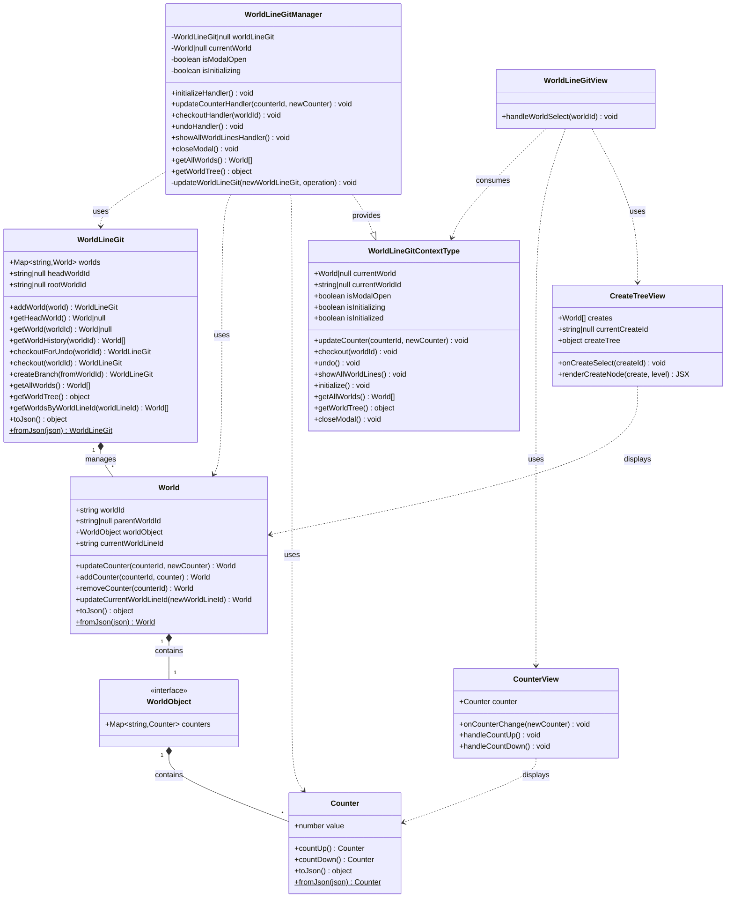

# WorldLineGit クラス図

## 概要
WorldLineGitは、Gitのような分岐構造を持つ世界線管理システムです。各世界（World）はWorldObjectを通じて複数のコンポーネント（現在はCounter）を管理し、世界の変更は新しい世界の作成として表現されます。WorldObjectという中間層を設けることで、Counterだけでなく、BubblesUIなど他のコンポーネントも簡単に追加できる拡張性の高い設計となっています。

---

## クラス図 (Mermaid)



---

## クラス詳細

### ドメイン層

#### Counter
**責務**: カウンター値の管理と不変性の保持

- `value: number` - カウンター値
- `countUp(): Counter` - カウンターを1増加（新しいインスタンスを返す）
- `countDown(): Counter` - カウンターを1減少（新しいインスタンスを返す）
- `toJson(): object` - JSON形式に変換
- `fromJson(json): Counter` - JSONから復元

**不変性**: すべての操作は新しいインスタンスを返します。

---

#### WorldObject
**責務**: 世界内のすべてのコンポーネントを含むコンテナ

- `counters: Map<string, Counter>` - この世界の複数のカウンター
- 将来の拡張用フィールド（例: `bubblesUI?: BubblesUI`）

**拡張性**: このインターフェースに新しいフィールドを追加することで、Worldクラスを変更せずに新しいコンポーネントタイプをサポートできます。

---

#### World
**責務**: 世界の状態を表現し、世界線の概念を含む。WorldObjectを通じて複数のコンポーネントを管理する。

- `worldId: string` - 世界の一意なID
- `parentWorldId: string | null` - 親世界のID（分岐元）
- `worldObject: WorldObject` - この世界に含まれるすべてのコンポーネント
- `currentWorldLineId: string` - 現在の世界線ID
- `updateCounter(counterId, newCounter): World` - 特定のカウンターを更新した新しい世界を作成
- `addCounter(counterId, counter): World` - 新しいカウンターを追加した新しい世界を作成
- `removeCounter(counterId): World` - カウンターを削除した新しい世界を作成
- `updateCurrentWorldLineId(newWorldLineId): World` - 世界線IDを更新
- `toJson(): object` - JSON形式に変換（worldObjectを含む）
- `fromJson(json): World` - JSONから復元（worldObject形式と旧形式の両方をサポート）

**不変性**: すべての更新操作は新しいWorldインスタンスを返します。

**拡張性**: WorldObjectという中間層を設けることで、Worldクラス自体を変更せずに新しいコンポーネントタイプを追加できます。

---

#### WorldLineGit
**責務**: 世界のコレクションを管理し、Git風のバージョン管理を提供

- `worlds: Map<string, World>` - すべての世界を格納
- `headWorldId: string | null` - 現在の世界（HEAD）のID
- `rootWorldId: string | null` - ルート世界のID
- `addWorld(world): WorldLineGit` - 新しい世界を追加
- `getHeadWorld(): World | null` - 現在の世界を取得
- `getWorld(worldId): World | null` - 指定された世界を取得
- `getWorldHistory(worldId): World[]` - 世界の履歴を取得
- `checkoutForUndo(worldId): WorldLineGit` - undo用チェックアウト（世界線ID変更なし）
- `checkout(worldId): WorldLineGit` - 指定された世界にチェックアウト
- `createBranch(fromWorldId): WorldLineGit` - 新しいブランチを作成
- `getAllWorlds(): World[]` - すべての世界を取得
- `getWorldTree(): object` - 世界のツリー構造を取得
- `getWorldsByWorldLineId(worldLineId): World[]` - 特定の世界線の世界を取得
- `toJson(): object` - JSON形式に変換
- `fromJson(json): WorldLineGit` - JSONから復元

**不変性**: すべての操作は新しいWorldLineGitインスタンスを返します。

---

### コンテキスト層

#### WorldLineGitContextType
**責務**: Reactコンポーネント間で状態とアクションを共有

**状態**:
- `currentWorld: World | null` - 現在の世界
- `currentWorldId: string | null` - 現在の世界ID
- `isModalOpen: boolean` - モーダル表示状態
- `isInitializing: boolean` - 初期化中フラグ
- `isInitialized: boolean` - 初期化済みフラグ

**アクション**:
- `updateCounter(counterId, newCounter): void` - 特定のカウンターを更新
- `checkout(worldId): void` - 指定された世界にチェックアウト
- `undo(): void` - 現在の世界線で子要素に移動（Ctrl+Shift+Z）
- `showAllWorldLines(): void` - すべての世界線を表示（Ctrl+Z）
- `initialize(): void` - 初期化（2つのCounterを含む初期世界を作成）
- `getAllWorlds(): World[]` - すべての世界を取得
- `getWorldTree(): object` - 世界ツリーを取得
- `closeModal(): void` - モーダルを閉じる

---

### フィーチャー層

#### WorldLineGitManager
**責務**: WorldLineGitの状態管理とRedux統合

**主要機能**:
- Redux状態の購読と更新
- ドメインオブジェクトの変換（JSON ↔ ドメインオブジェクト）
- キーボードショートカットの処理
  - `Ctrl+Z`: すべての世界線を表示
  - `Ctrl+Shift+Z`: 現在の世界線で次の世界に移動（undo）
- WorldLineGitContextの値を提供

**状態管理ロジック**:
- カウンター更新時、子要素がある場合は新しい世界線IDを生成
- 子要素がない場合は現在の世界線で継続

---

### UI層

#### CounterView
**責務**: カウンターの表示と操作

- `counter: Counter` - 表示するカウンター
- `onCounterChange(newCounter): void` - カウンター変更時のコールバック
- `handleCountUp()` - カウントアップボタンのハンドラー
- `handleCountDown()` - カウントダウンボタンのハンドラー

---

#### CreateTreeView
**責務**: 世界のツリー構造を視覚化

- `creates: World[]` - 表示する世界のリスト
- `currentCreateId: string | null` - 現在選択されている世界ID
- `onCreateSelect(createId): void` - 世界選択時のコールバック
- `createTree: object` - 世界のツリー構造
- `renderCreateNode(create, level)` - 世界ノードを再帰的にレンダリング

---

#### WorldLineGitView
**責務**: メインのビューコンポーネント

**表示要素**:
- 初期化ボタン（未初期化時）
- 現在の世界のカウンター（初期化済み時）
- 世界ツリー（Ctrl+Zで表示）

---

## アーキテクチャパターン

### 階層構造
```
UI層 (WorldLineGitView, CounterView, CreateTreeView)
    ↓ (Context経由)
Feature層 (WorldLineGitManager)
    ↓ (Redux経由)
Domain層 (WorldLineGit, World, Counter)
```

### データフロー
1. **ユーザー操作** → UI層
2. **アクション実行** → Feature層（Context経由）
3. **ドメインロジック実行** → Domain層
4. **状態更新** → Redux
5. **再レンダリング** → UI層

### 不変性パターン
すべてのドメインクラス（Counter, World, WorldLineGit）は不変であり、更新操作は常に新しいインスタンスを返します。これにより：
- 予測可能な状態管理
- タイムトラベルデバッグの実現
- Redux統合の簡素化

---

## 世界線の概念

### 世界線とは
- 各世界は`currentWorldLineId`を持つ
- 同じ世界線IDを持つ世界は連続した一つの時間軸を表す
- 分岐が発生すると新しい世界線IDが生成される

### 分岐のルール
- 子要素がない世界でカウンターを変更 → 同じ世界線で継続
- 子要素がある世界でカウンターを変更 → 新しい世界線を作成

### キーボードショートカット
- **Ctrl+Z**: すべての世界線をモーダルで表示
- **Ctrl+Shift+Z**: 現在の世界線で次の世界に移動（redo的な動作）

---

## Redux統合

WorldLineGitManagerは以下のRedux機能を使用：
- `useAppSelector`: 状態の購読
- `useAppDispatch`: アクションのディスパッチ
- `selectWorldLineGit`: WorldLineGit状態の選択
- `selectHeadWorld`: 現在の世界の選択
- `initialize`: 初期化アクション
- `updateState`: 状態更新アクション

---

## 使用例

```typescript
// 初期化（2つのCounterを含む初期世界を作成）
initialize();

// 特定のカウンターを増加
const counter1 = currentWorld.worldObject.counters.get('counter-1');
if (counter1) {
  const newCounter = counter1.countUp();
  updateCounter('counter-1', newCounter);
}

// 別のカウンターを減少
const counter2 = currentWorld.worldObject.counters.get('counter-2');
if (counter2) {
  const newCounter = counter2.countDown();
  updateCounter('counter-2', newCounter);
}

// 過去の世界にチェックアウト
checkout(someWorldId);

// 現在の世界線で次の世界に移動
undo();

// すべての世界線を表示
showAllWorldLines();

// 全てのCounterを取得
const allCounters = Array.from(currentWorld.worldObject.counters.entries());
allCounters.forEach(([id, counter]) => {
  console.log(`${id}: ${counter.value}`);
});
```

---

## まとめ

WorldLineGitは、以下の特徴を持つ洗練された世界線管理システムです：

1. **不変性**: すべてのドメインオブジェクトが不変
2. **Git風の操作**: checkout, undo, branch作成など
3. **世界線の概念**: 並行する複数の時間軸を管理
4. **WorldObject設計**: 中間層としてWorldObjectを導入し、拡張性を確保
5. **複数コンポーネント対応**: 一つの世界に複数のコンポーネント（現在はCounter）を含む
6. **高い拡張性**: WorldObjectに新しいフィールドを追加するだけで、BubblesUIなど他のコンポーネントをサポート可能
7. **React統合**: Context APIとReduxを活用
8. **キーボードショートカット**: 直感的な操作
9. **ツリー視覚化**: 世界の親子関係を視覚的に表示
10. **後方互換性**: 旧形式のデータもサポート

