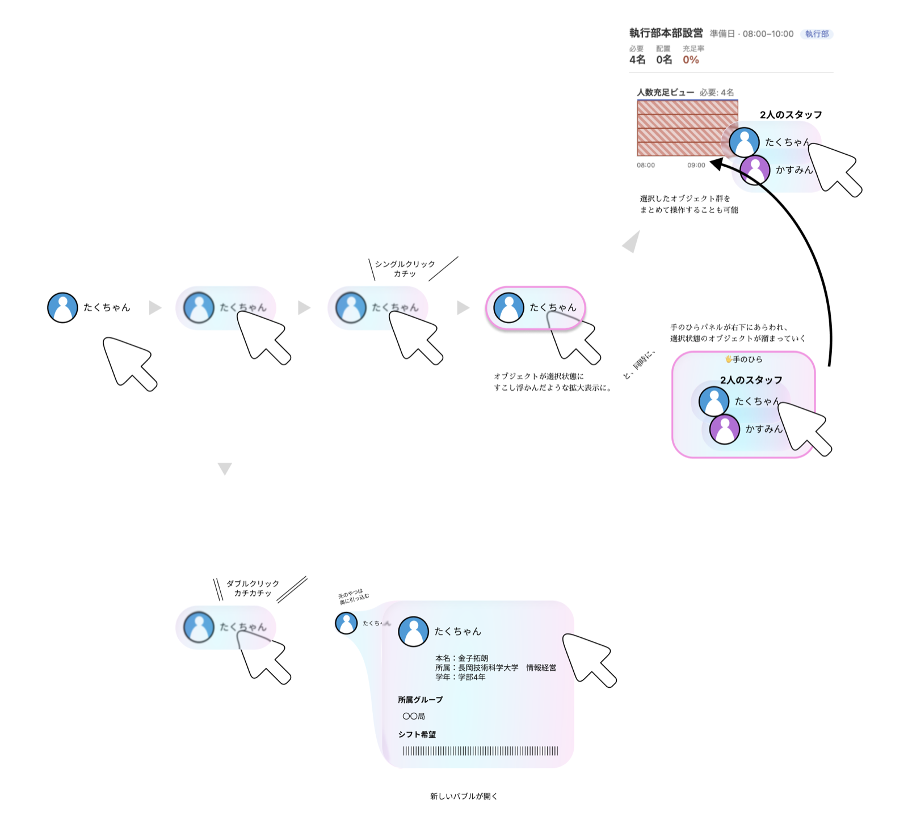

# 単クリックか、ダブルクリックか

新しい UI を足すとき、押したら何かが開くものについて「単クリックにするか、ダブルクリックに
するか」を毎回考えなくて済むようにするための判定ルール。

---

## 判定

> **そこに既に在る「もの」を開くならダブルクリック。押すと世界が変わるなら単クリック。**

| | ダブルクリック | 単クリック |
|---|---|---|
| 何をする | **すでに在るもの**を開く | 作る・実行する・消す。または今のバブル自身のコントロール |
| 書き方 | `ObjectView` | `<button>` のまま |
| 例 | 一覧の行、表のセル、バッジ、チップ、世界線ビュー、操作履歴、レポート一覧、タスク軸、スタッフ別表示 | 新規作成、CSVインポート、自動シフト配置、絞り込み検索、削除、戻る、閉じる、トグル、フィルタ解除 |

判断に迷ったら **「開く先のオブジェクトは、押す前から存在するか？」** を聞く。

- 存在する → ダブルクリック（`ObjectView`）
- 押した結果はじめて生まれる → 単クリック（`<button>`）

「絞り込み検索」がダブルクリックでないのはこの基準による。開く先は検索**結果**であって、
押す前から在るオブジェクトではない。「+ N名追加」（勤務表の空き枠）も同じ理由で単クリック。

---

## 見た目：泡の膜

`ObjectView` に hover（またはキーボードでフォーカス）すると、中身の**前面に半透明の泡の膜**が出る。
桃 → 藤 → 水 → 若草のグラデーションに、左上の光沢と白いふち。

**この膜が「掴める・ダブルクリックで開ける」の唯一の合図。** 逆に言うと、

- 膜が出る → 必ずドラッグできるか、ダブルクリックで開ける
- 膜が出ない → どちらもできない

を守る。掴めも開けもしない `ObjectView`（型が無くてドラッグのペイロードが載らない、
`openingPosition` も型登録も無い）には出さない。これは `ObjectView` 側が
`data-film="on" / "off"` で自動的に判断するので、使う側は何もしなくてよい。

### 使う側が触れるところ

膜の丸みだけ、CSS カスタムプロパティで変えられる（既定 12px）。

```css
.e-kyusei-hit {
  --object-view-film-radius: 50%;   /* 円形のタイルは丸い膜で包む */
}
```

### 入れ子のときは内側だけ光る

行の中のバッジ、セルの中のチップのように `ObjectView` が入れ子になっているとき、
内側にホバーすると**外側の膜は引っ込む**。ダブルクリックで内側が勝つ
（`stopPropagation`）のと同じ決まりを見た目にも通してある。

### 実装のきまり

- **JS の状態を持たない。** `ObjectView` は表のセルに何百個も並ぶ。hover を `useState` で
  持つとマウスが動くたびに再レンダリングが走るので、CSS の `:hover` だけで完結させている
- **膜の箱はラッパ span が持つ。** その外側の `UrledPlace` は `display: contents` で
  箱を持たないので基準にできない。中身が `position: absolute` のときはラッパが潰れて
  膜も出なくなるので、「位置を持つ枠」と「見た目」を分けて後者を包むこと
- **膜はクリックを透かす**（`pointer-events: none`）

---

## ダブルクリック側：`ObjectView` で包む

`ObjectView` は3つを同時に満たす。

- オブジェクトを表す（`data-url` が付き、link bubble のリボンがそこから伸びる）
- ドラッグできる（ポケットに入れられる、宇宙に落とすとその場に開く）
- ダブルクリックでバブルが開く

```tsx
<ObjectView
  type="Staff"
  url={buildStaffUrl(staff.id)}
  label={staff.name}
  openingPosition="bubble-side-right"
>
  <div className="e-row" title="ダブルクリックでスタッフを開く">…</div>
</ObjectView>
```

### 落とし穴

**`openingPosition` を書かないと、黙って開かない。**
`ObjectView` は `openingPosition` も `registerObjectBubble` も無いと、ダブルクリックの
ハンドラ自体を付けない。URL を渡しただけでは開かない。

```ts
const canOpenBubble = !!resolvedUrl && (openingPosition !== undefined || bubbleConfig !== undefined);
```

**型を登録しないと、ドラッグは始まるのに誰も受け取らない。**
宇宙もポケットも、受け入れ側は登録済みの型でしか絞らない。`type` を書いたら
必ず `<bubly>-libs/src/object-type-registration.ts` にも `registerObjectType` を足す。

**`openingPosition` は指定ではなくヒント。**
URL が `/history` で終わると画面下ストリップに、surface 最前面と型が一致すると
`joinSibling` に流れて無視される。「指定したのに位置が違う」で悩まない。

**単クリックが無反応になるので `title` を必ず付ける。**
`cursor: pointer` のまま単クリックが効かないのは分かりづらい。
`title="ダブルクリックで◯◯を開く"` を漏らさず書く。

---

## 「すでに在るものを開くボタン」をチップに変える

ラベル付きボタン（「🌐 世界線ビュー」「スタッフ別表示」など）は、`<button>` をやめて
`ObjectView` の中の `<span>` にする。

```tsx
// before
<UrledPlace url={worldLineUrl}>
  <button className="e-link" onClick={onOpenHistory}>🌐 世界線ビュー</button>
</UrledPlace>

// after
<ObjectView type="ScheduleWorldLine" url={worldLineUrl} label="世界線ビュー"
            openingPosition="bubble-side-bottom">
  <span className="e-link" title="ダブルクリックで世界線ビューを開く">🌐 世界線ビュー</span>
</ObjectView>
```

**`<button>` をそのまま `ObjectView` で包んではいけない。**
`ObjectView` は `<span role="button" tabIndex={0}>` を描くので、中に本物の `<button>` が
入ると focusable が2つ・`role=button` の入れ子になり、内側の button が Enter / Space を
吸ってしまう。MUI の `Button` を使いたいときは `component="span"` にする。

見た目のクラスは `<span>` に残す。`<button>` は既定で inline-block だが `<span>` は
inline なので、`display: inline-flex; align-items: center;` を共有 CSS に1行足す。

### 例外：小さなアイコンボタン

20px 弱のアイコンで、ドラッグして持ち出す意味も薄いものは `<button>` のままにして
`onClick` → `onDoubleClick` に載せ替え、リボンだけ `UrledPlace` で確保する。
理由をコードにコメントで残すこと。

---

## レイアウトを壊さないために

`ObjectView` はラッパの `<span>` を1枚挟む。これが効く場面がある。

| 状況 | 対処 |
|---|---|
| 親が flex/grid で、中身が `flex: 1` や `margin-left: auto` を持っている | その指定を `className` prop でラッパへ引き上げる。中に残しても効かない |
| 中身が縦積みだった | ラッパは `display: inline-flex`（`fullWidth` なら `flex`）。`flex-direction: column` を与えて戻す |
| `<td>` / `<tr>` を包みたい | **包まない。** `<table>` の中に `<span>` が入るとブラウザの table fixup で表の外へ叩き出される。`<td>` の**中身**を包む |
| 中身が `position: absolute` | 外から包むとラッパが実質0サイズになり、クリックもドラッグも拾えない。「位置を持つ枠」と「見た目」に分け、見た目のほうを包む |
| 中身が既に `draggable` で自前のドラッグを持っている | `ObjectView` に `draggable={false}` を渡す。両方付けると `dragstart` が二重に走る |

---

## キーボード

`ObjectView` は `Enter` / `Space` を「開く」に割り当てる。キーボードに「ダブル」に
当たる打鍵が無いため。マウスの単クリックは開かないのに Enter では開く、という非対称は
意図的で、`role="button"` と `tabIndex={0}` を名乗っている以上、キーボードで無反応な
ほうが不具合。

---

## 単クリックに仕事を残す場合

開くのはダブルクリックにしつつ、単クリックに別の仕事（選択など）を残せる。
`ObjectView` の `onClick` に渡す。

```tsx
<ObjectView … openingPosition="bubble-side-right" onClick={() => onStaffSelect(staff.id)}>
```

ダブルクリック時は `click` が2回先に走ってから `dblclick` が来るので、
「選んでから開く」の順序は保たれる。

なお `onClick` に「開く」処理を残したまま `openingPosition` も付けると、
**ダブルクリックでバブルが3つ開く**（`onClick` 2回 + registry 1回）。片方だけにすること。

---

## 設計の出典

このルールと泡の膜は、下の設計スケッチから来ている。



図のうち **hover の膜**（左から2〜3コマ目）と **ダブルクリックで新しいバブルが開く**（下段）は
実装済み。**シングルクリックでの選択状態**（4コマ目のピンクの輪郭）と
**🖐手のひらパネル**（右下に選択が溜まる）はまだ無い。

単クリックが空いているのは、そこに「選ぶ」が入る予定だから。
どういう選択にするかは [selection-and-scope.md](./selection-and-scope.md) で決めてある。

---

## 関連

- [selection-and-scope.md](./selection-and-scope.md) — 単クリックに入る「選択」の設計
- [universe-drop-zone.md](./universe-drop-zone.md) — 誰も受け止めなかったドロップを宇宙が受け止める話
- [bubly-spec.md](./bubly-spec.md) — バブリの構成
