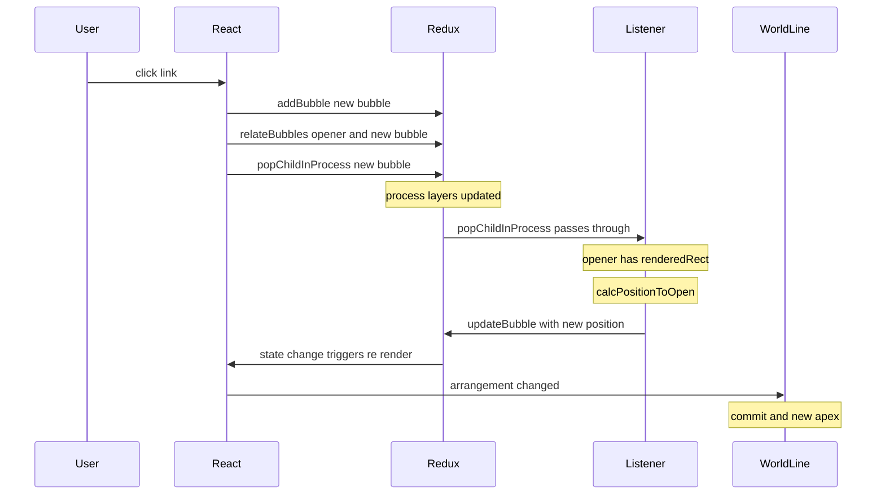
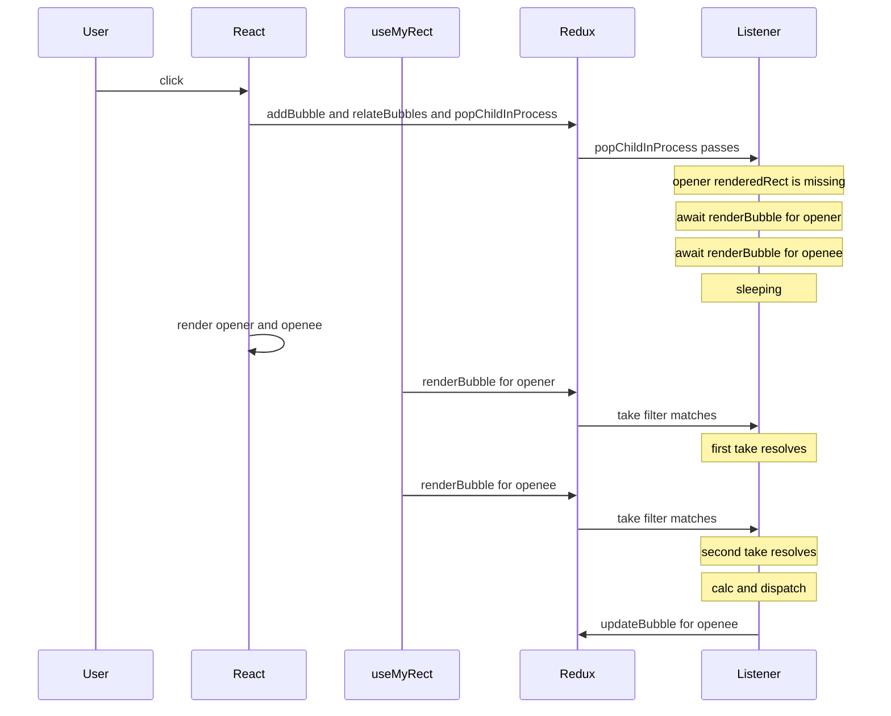
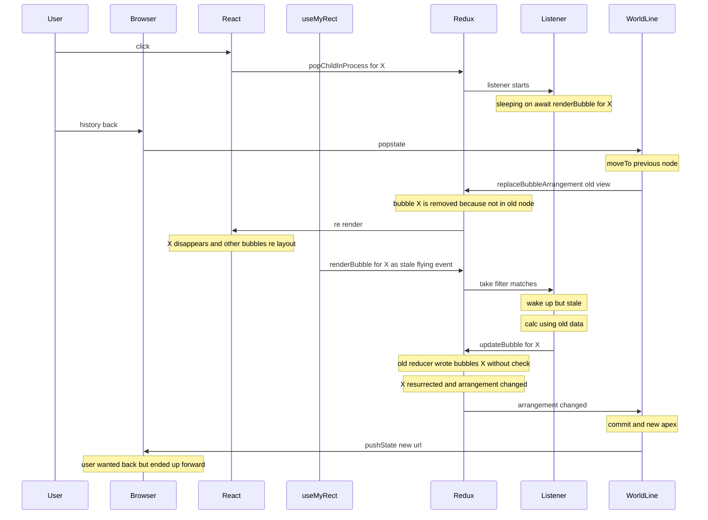
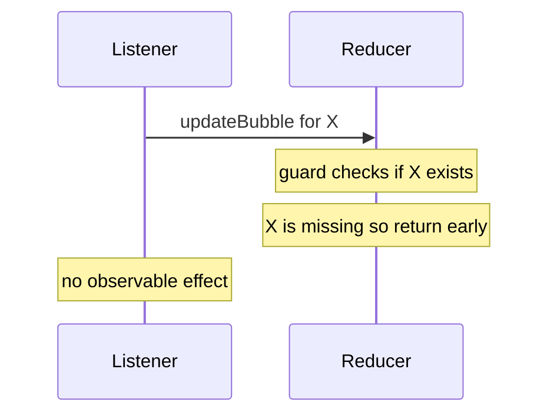
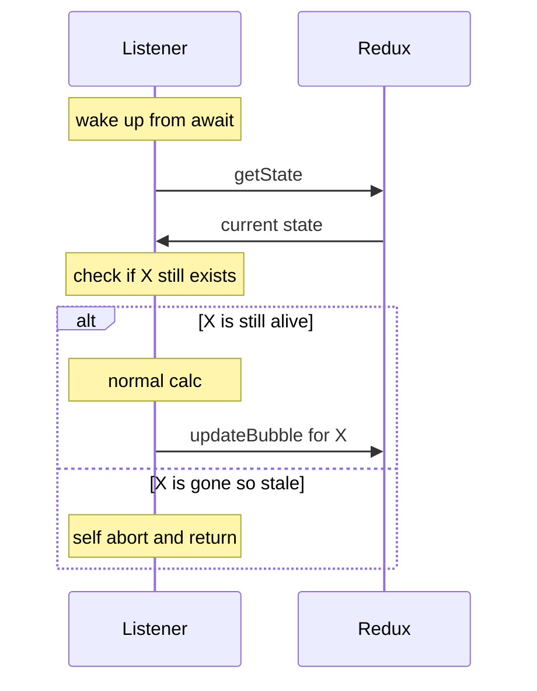

# popChild の流れと `bubbles-listener` async タスクの寿命

## このドキュメントの目的

[`bubbles-listener.ts`](../bublys-libs/bubbles-ui/src/lib/state/bubbles-listener.ts) に `popChildInProcess` などをトリガーにした **async listener** が住んでいる。それが「いつ起動して」「いつまで生きていて」「rehydrate（世界線の戻る）と衝突したらどうなるか」を、シーケンス図で 1 つずつ追う。

[recursive-universe.md](recursive-universe.md) の不是 D の元ネタ。

---

## 登場人物

| 名前 | 何 | どこ |
|---|---|---|
| **User** | ボタンを押す人 / 戻るを押す人 | ブラウザ |
| **React** | コンポーネントレンダリングと DOM 計測 | レンダリング層 |
| **useMyRect** | 各バブルの DOM rect を計測して `renderBubble` を dispatch する hook | [`hooks/useMyRect.ts`](../bublys-libs/bubbles-ui/src/lib/hooks/useMyRect.ts) |
| **Redux** | スライス state と reducer | [`bubbles-slice.ts`](../bublys-libs/bubbles-ui/src/lib/state/bubbles-slice.ts) |
| **Listener** | Redux Toolkit の `createListenerMiddleware`。「特定 action 後の副作用」を書く場所 | [`bubbles-listener.ts`](../bublys-libs/bubbles-ui/src/lib/state/bubbles-listener.ts) |
| **WorldLine** | universe の世界線（commit / rehydrate） | [`useUniverseArrangementWorldLine.ts`](../apps/bublys-os/app/bubble-ui/world-line/useUniverseArrangementWorldLine.ts) |
| **Browser** | ブラウザ履歴とアドレスバー（root 専用） | — |

「listener」は Redux 用語ではないので**新顔扱い**が正解。**「特定 action が dispatch されたら裏で async タスクを回す機械」**。普通の useEffect と違うのは、コンポーネント外に常駐していて、画面のレンダリングと無関係に走り続けられること。

---

## シーン1: 普通の popChild（即時パス）

`opener` の `renderedRect` が既に DOM 計測済みのとき。**待たずに**位置を計算して dispatch する。



ここまでは listener が瞬時に走り終わって消える。問題なし。

---

## シーン2: opener の rect が無いとき（待ちパス）

opener がまだ DOM レンダリング前で `renderedRect` が無いと、listener は計算できないので**`renderBubble` action を待つ**。これが async / `await` の正体。



ここで重要なのは **`await listenerApi.take(...)` は何秒でも何分でも待つ**こと。マッチする action が来るまで Promise が解決しないだけの仕掛け。`setTimeout` のような期限は無い。

これがシーン3の悪夢の伏線。

---

## シーン3: 不是 D の発生（rehydrate を跨ぐ stale listener）

シーン2の「sleeping」状態のまま、ユーザーが「戻る」を押したらどうなるか。



これが「**戻るを押すと進んじゃう**」「**履歴が2-3回で頭打ちになる**」症状の正体。

---

## 現状の対処（reducer ガード）

[`bubbles-slice.ts`](../bublys-libs/bubbles-ui/src/lib/state/bubbles-slice.ts) の `updateBubble` / `renderBubble` reducer に「**存在しないバブルへの dispatch は黙って捨てる**」ガードを入れた：

```ts
updateBubble: {
  reducer: (state, action) => {
    const u = draftUniverse(state, action.meta.universeId);
    if (!u.bubbles[action.payload.id]) return;  // この行
    u.bubbles[action.payload.id] = action.payload;
    state.renderCount += 1;
  },
  ...
}
```

これでシーン3最後の `dispatch(updateBubble(X, moved))` が **state に何の変化も起こさない**。arrangement が変わらないので commit されず、pushState も走らない。**症状は止まる**。



---

## まだ「治っていない」もの

reducer ガードはあくまで**症状の出口を塞いだだけ**。構造的には次のいくつかが残る：

1. **stale listener が裏でずっと sleeping している**期間がある。観測しにくい
2. **renderBubble が「過去のタスクのトリガー」を兼任**してる。description が混線
3. 別の async listener を将来追加したら、また同じ罠を踏む可能性がある（reducer ガードは listener 個別じゃなく action 個別なので、新 action にはまた書く必要）
4. **debug が大変**：「あれ、何で commit が走ったの？」を辿るとき、stale listener という見えない経路を疑う必要がある

---

## 提案: listener 内 self-abort（不是D 修正案 2）

stale な状態で起き上がった listener が、dispatch する前に **「自分の対象バブルがまだ生きてるか」をチェックして、stale なら return** するパターン。



reducer ガードはサイレントな安全網として残し、**listener 側にもアクティブな自己診断**を載せる二重構え。listener のコードを読んだ人が「stale 検知ロジックが**この場所に**あるんだな」と気づける。

実装は数行で済む：

```ts
// 既存の await listenerApi.take(...) の直後、計算の前に
const fresh = listenerApi.getState() as any;
const stillAlive = selectBubble(fresh, { id: poppingBubbleId, universeId });
if (!stillAlive) return;

// 以降、既存ロジック（位置計算 + dispatch updateBubble）
```

これで「listener が rehydrate を跨いで生きている」事実は変わらないが、起き上がった瞬間に**自分が時代遅れだと気づいて諦める**ので、外部から見ると一貫性が保たれる。
